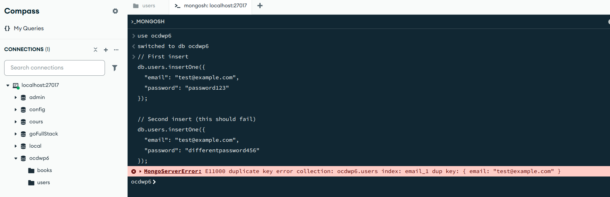

Remarque:
L'installation de mongoose-unique-validator par la commande:
```zsh
npm install mongoose-unique-validator
```
n'est plus fonctionnelle pour mongoose@"^8.9.3", en effet la propriété `unique: true` suffit désormais lors de la déclaration du schéma pour ensurer la unicité de la valeur dans une base de données MongoDB après une première indexation préalable.
Preuve de tentative d'insertion de doublons via MONGOSH dans MongoDB Compass:

